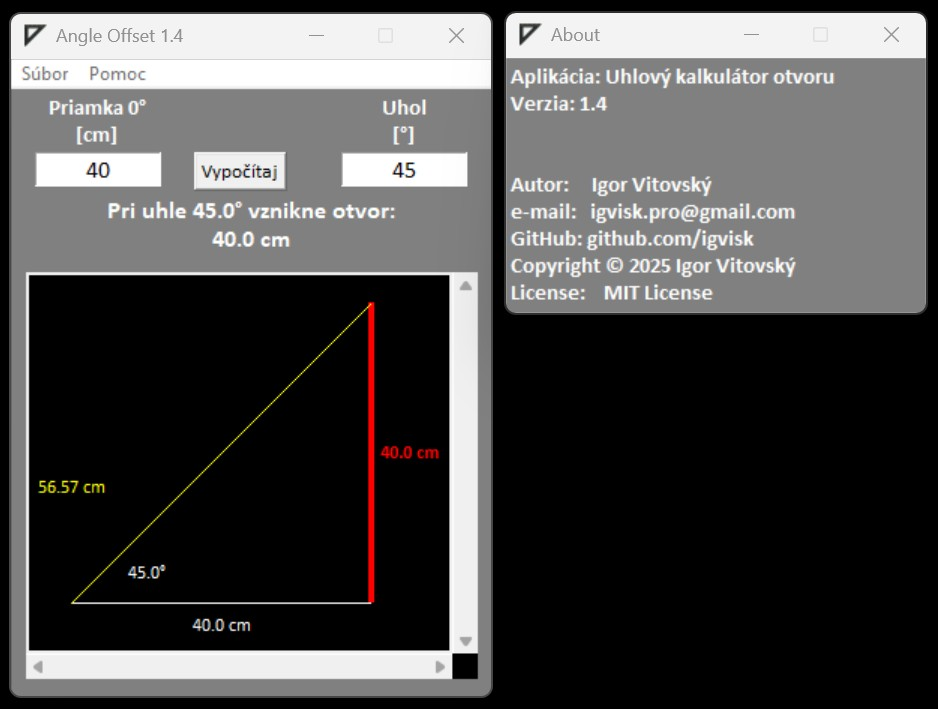

\# 🧮 Angle Offset Calculator


\[!\[License: MIT](https://img.shields.io/badge/License-MIT-blue.svg)](LICENSE)


\*\*Author:\*\* Igor Vitovský  

\*\*License:\*\* MIT License  


A \*\*Python + Tkinter\*\* application that calculates the width of an opening (perpendicular side) based on a given angle and the length of the base line. It also provides a graphical representation of the triangle in a `Canvas` widget with support for scrolling and mouse dragging.


---


\## ✨ Features


\- Calculation of:

&nbsp; - the perpendicular side (opening) based on the given base and angle

&nbsp; - the hypotenuse (slanted side)

\- Graphical visualization of the triangle in \*\*Canvas\*\* with scaling

\- Ability to move the drawing with the mouse or scrollbars

\- Simple GUI built with Tkinter

\- Menu with keyboard shortcuts:

&nbsp; - \*\*Ctrl+N\*\* – new calculation

&nbsp; - \*\*Ctrl+Q\*\* – quit

&nbsp; - \*\*F1\*\* – application information

&nbsp; - \*\*Esc\*\* - quit app info window

\- \*About\* window with author and license details


---


\## 📐 Geometric Model


\- \*\*Inputs:\*\*

&nbsp; 1. Length of the base line (adjacent side)

&nbsp; 2. Angle of the slanted line (default value: 5°)


\- \*\*Outputs:\*\*

&nbsp; 1. Length of the perpendicular side (opening) – opposite side

&nbsp; 2. Length of the hypotenuse

&nbsp; 3. Graphical representation of the triangle in `Canvas`


---


\## 🚀 Installation and Run


1\. Make sure you have \*\*Python 3.8+\*\* installed.

2\. Clone the repository:

&nbsp;  ```bash

&nbsp;  git clone https://github.com/igvisk/angle-offset-calculator.git

&nbsp;  cd angle-offset-calculator

&nbsp;  ```

3\. Run the application:

&nbsp;  ```bash

&nbsp;  python angle\_offset.py

&nbsp;  ```


---


\## 🖼️ Application Preview

[]


---


\## 📂 Project Structure


```

angle-offset-calculator/

│

├── angle\_offset.py      # main application source code

├── icon.ico             # application icon

├── README.md            # documentation

└── LICENSE              # MIT license

```


---


\## 📜 License


This project is licensed under the \*\*MIT License\*\*.  

See the \[LICENSE](LICENSE) file for more details.


---


\## 👨‍💻 Author


\- \*\*Igor Vitovský\*\*  

\- 📧 igvisk.pro@gmail.com  

\- 🌐 \[github.com/igvisk](https://github.com/igvisk)

```


---

